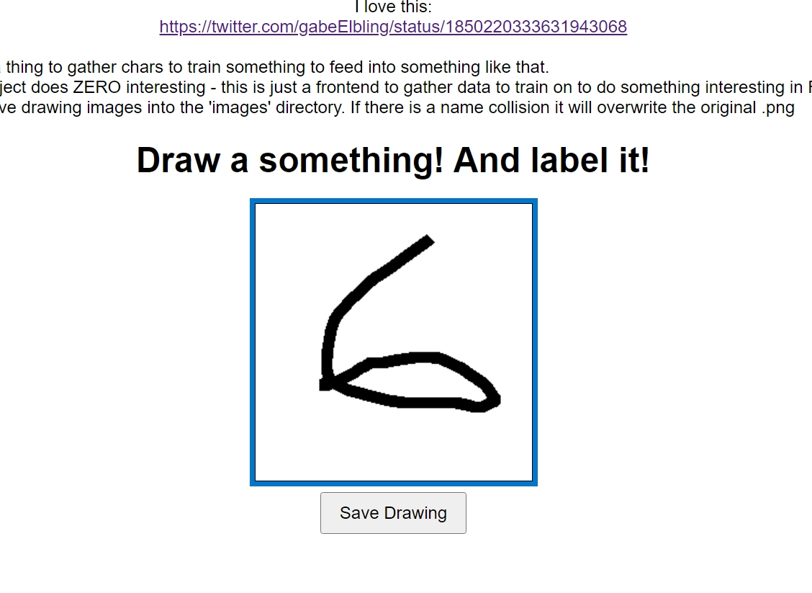

# repo
https://github.com/mulefish/scribble_little_images

# lang 
python + browser

# insipireation (sic)
https://x.com/gabeElbling/status/1850220333631943068

# tests
None! Silly. This is a one off

# output

